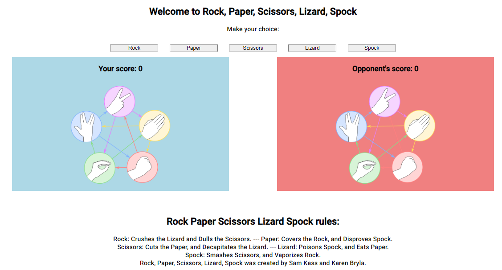

# Rock, Paper, Scissors, Lizard, Spock Game #
Rock, Paper, Scissors, Lizard, Spock is a varient of Rock Paper Scissors invented by Sam Kass and Karen Bryla, the game recieved a large amount of attention when featured in an episode of the sitcom "The Big Bang Theory". This site allows players to play games of Rock, Paper, Scissors, Lizard, Spock with a computer opponent.

## Features ##

The site features a clean and clear design. Text is intentionally high contrast with a clear font to ensure that everyone can enjoy it.
The site also features a footer which explains the game rules and also credits the original creators.

### Gameplay ###

The player can select any of the 5 clearly labled buttons in order to play the game, they can learn by playing, or consult the rules at the bottom of the page.
The opponent is automated, selecting a random result each round.

### Game Results ###

When the player selects a button, an image of their choice is shown on the left side of the screen.
The javascript code then determines which move the opponent will play and then presents their choice on the right side of the screen.
The result is then calculated and the player is informed if they won, lost, or drew the round.
If the player won their score is updated.
If the player loses their opponents score is updated.

### Footer ###

The footer contains the rules of the game.
The footer lets the user know about the original creators of the game.

## Features to implement ##

Difficulty levels can be introduced. The game can store the player's previous choice and then choose its play for next round based on that information.
To expand beyond that, the player's results can be stored in an array and then using a for loop the program could determine the most choice most likely to win based on multiple previous games.

## Testing ##

The game has been tested in multiple browsers and on multiple device types.

I have ensured that the logic for the game result is correct and as such the winning result will always be correct.

The fonts and colors have been chosen specifically to be clear and accessible.

The site was tested using Lighthouse in chrome and performed satisfactorly.

Images provided by Icon Library: https://icon-library.com/

Game Chart provided by Big Bang Theory Wiki: https://bigbangtheory.fandom.com/wiki/Main_Page
